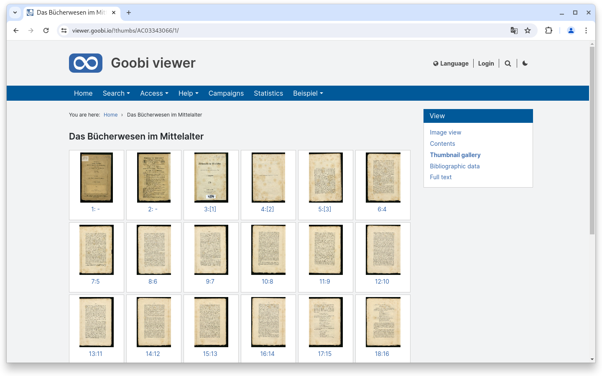
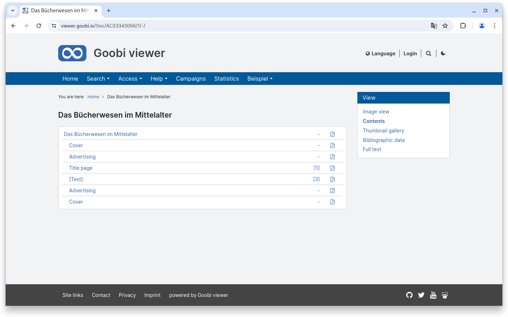
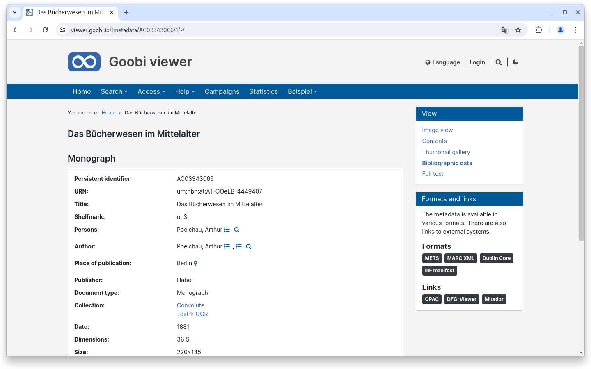
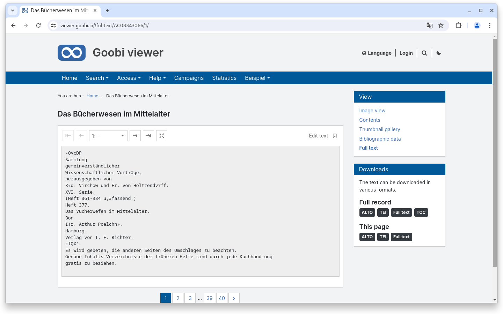
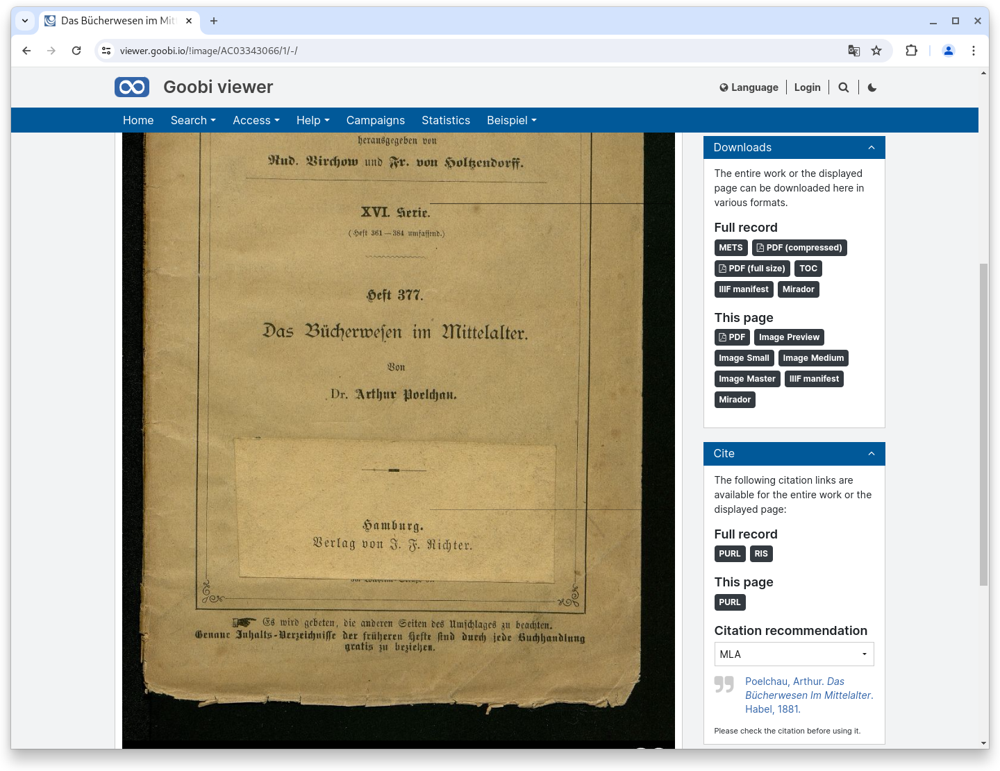
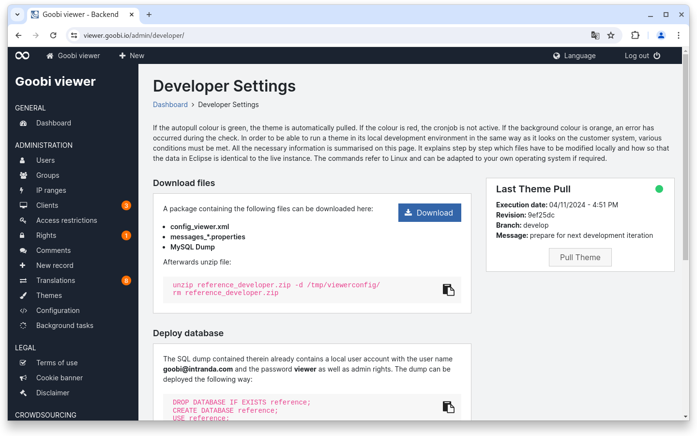
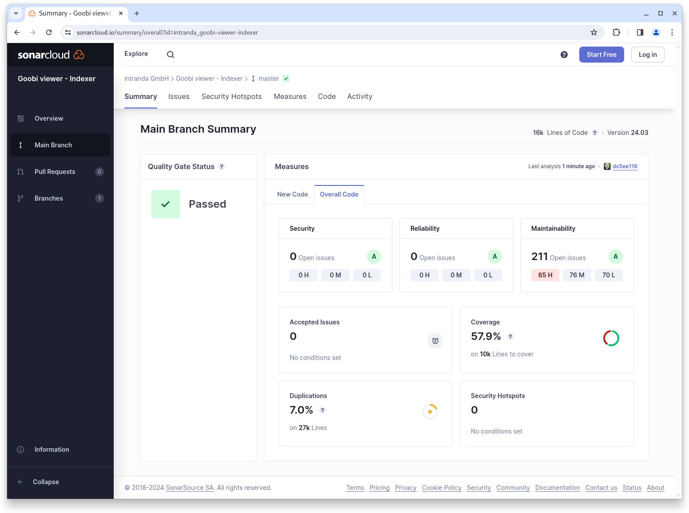
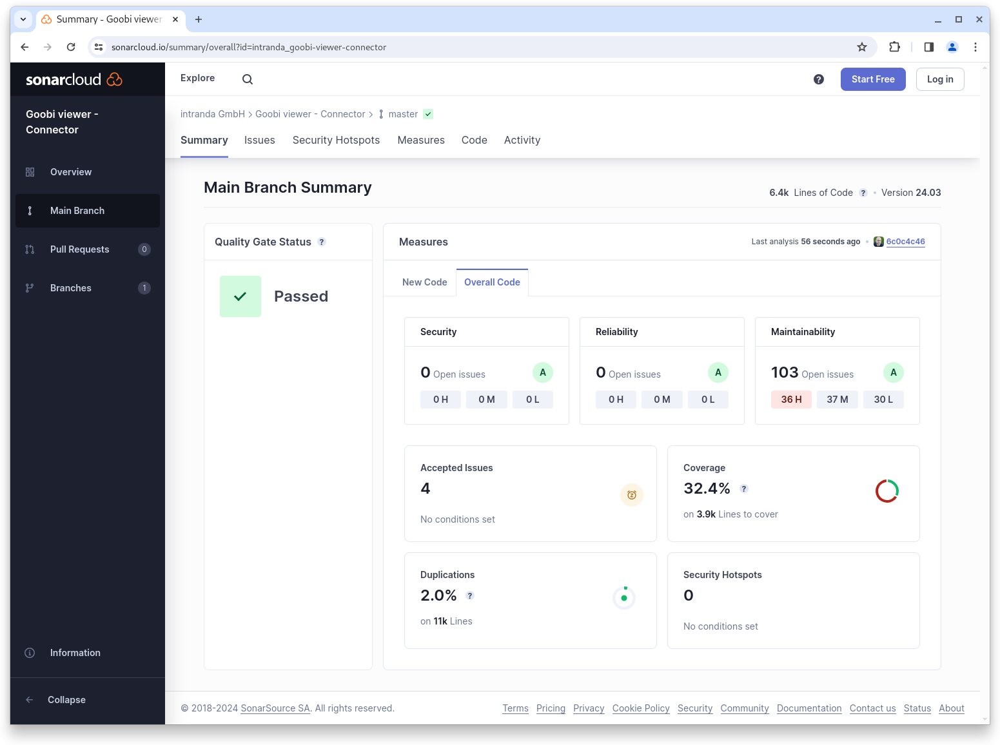

# March

## Coming soon :rocket:&#x20;

* **Live preparation** of records
* **Revision of EAD** structures
* **Accessibility**

## Developments

### Widgets

It's been a long time coming, but now it's finally here. The "Cite and reuse" widget has been split up and the sidebar on the various views of the work view has been tidied up and streamlined. Based on feedback from a UX study, we took the "less is more" motto to heart and asked ourselves the following questions:

* What kind of terminology is expected? ... and
* What kind of functionality is expected?

The result is various widgets that offer context-related content. On the "Table of contents" and "Page preview" page, the sidebar is now very tidy and there are no longer any additional widgets available. On the "Bibliographic data" page, there is the new "Formats and links" widget, where the displayed metadata is available in various formats as well as links to external pages, such as the library catalog, the DFG viewer or a Mirador instance. There is a new "Downloads" widget on the "Full text" page. Here you can download either the current text of the page or the full text of the entire dataset in various formats.

<div>

<figure><figcaption><p>The sidebar in the page preview has been cleaned up</p></figcaption></figure>

 

<figure><figcaption><p>The sidebar in the table of contents is now also almost empty.</p></figcaption></figure>

</div>

<figure><figcaption><p>There is a new widget "Formats and links" on the bibliographic data page</p></figcaption></figure>

<figure><figcaption><p>The various text options are available in the "Downloads" widget on the full text page</p></figcaption></figure>

<figure><figcaption><p>The "Downloads" and "Cite" widgets are now available in the image display</p></figcaption></figure>

### Admin

For developers, there is now a new area in the backend where a package can be downloaded for commissioning in the local development environment. It is also possible to update a theme checked out via git on the server by pressing a button in the backend. This area supports developers in rectifying reported bugs and installing small styling updates.

<figure><figcaption><p>New developer area in the backend</p></figcaption></figure>

### IIIF

From now on it is also possible to generate a complete IIIF Presentation Manifest ONLY with the current image. This option is available in the new "Downloads" widget in the factory view.

### Goobi viewer Indexer

The Goobi viewer Indexer has been given the option of indexing complete EAD files and saving them in the Solr search index. This is the preparation for a revised archive display in the Goobi viewer Core.

Furthermore, the values of the TYPE attribute in the physical tree of METS files that the Goobi viewer recognizes as permissible values are now configurable. Previously, hard-coded `page` was allowed, but from now on other values such as `object`, `audio` or `video` can also be configured, which are then to be processed as "page" in the plant.

Finally, a bug has been fixed where the check for available free memory failed if this free memory area was very large. See also the following thread in the Community Forum:



### Snippets&#x20;

* Connector: There was a bugfix for the cursor in the resumption token
* Core: Content from CMS pages that had not yet been published was still partially visible.
* Core: Japanese and Polish have been added as additional potential languages

## Code analysis

The following screenshots show the SonarCloud analysis of the current release. More information is available directly on the [project page](https://sonarcloud.io/organizations/intranda/projects).

<figure><figcaption><p>SonarCloud Analysis: Goobi viewer Core - for the Git Tag v24.03</p></figcaption></figure>

<figure><figcaption><p>SonarCloud Analysis: Goobi viewer Indexer - for the Git Tag v24.03</p></figcaption></figure>

<figure><figcaption><p>SonarCloud Analysis: Goobi viewer Connector - for the Git Tag v24.03</p></figcaption></figure>

## Version numbers&#x20;

The versions that must be entered in the `pom.xml` of the theme in order to get the functions described in this digest are:

```markup
<dependency>
    <groupId>io.goobi.viewer</groupId>
    <artifactId>viewer-core</artifactId>
    <version>24.03</version>
</dependency>
<dependency>
    <groupId>io.goobi.viewer</groupId>
    <artifactId>viewer-core-config</artifactId>
    <version>24.03</version>
</dependency>
<dependency>
    <groupId>io.goobi.viewer</groupId>
    <artifactId>viewer-connector</artifactId>
    <version>24.03</version>
</dependency>
```

The **Goobi viewer Indexer** has the version number **24.03**\
The **Goobi viewer Crowdsourcing Module** has the version number **24.03**
