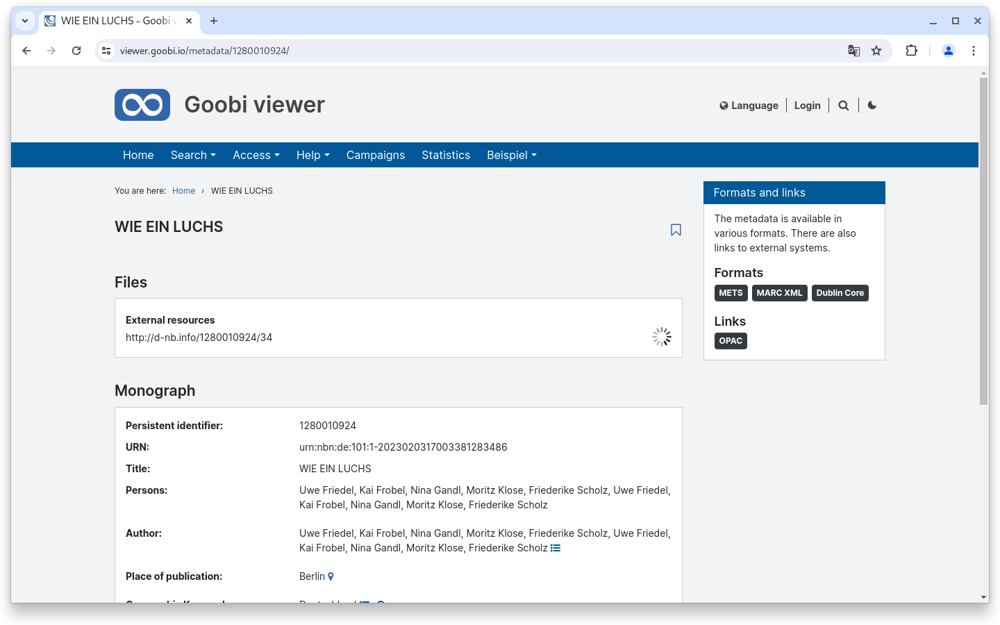
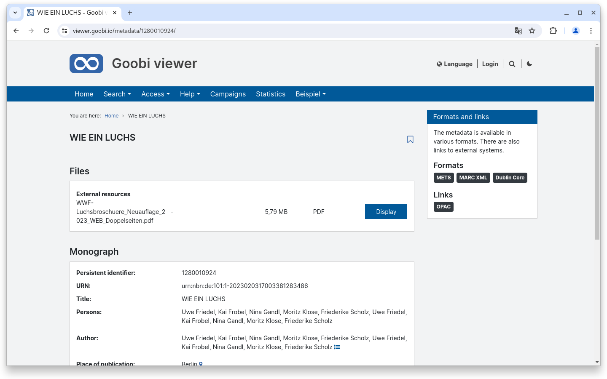
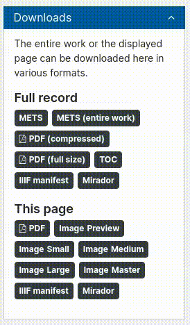
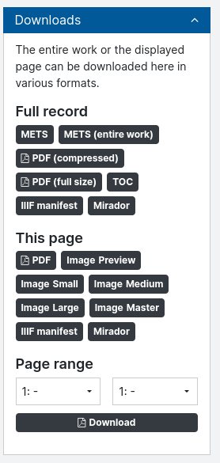
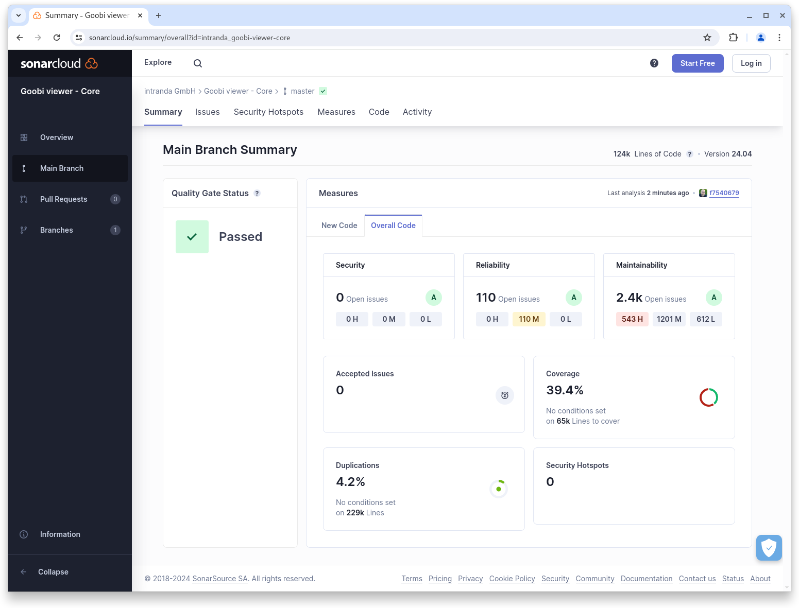

# April

## Coming soon :rocket:&#x20;

* **Revision of EAD** structures
* Styling of **booleans** in the **faceting**
* new **CMS elements**
* **technical metadata** from images

## Core

### Live preparation of records

The Goobi viewer can now retrieve external content from Born Digital documents and prepare it live. This makes it possible to export only the metadata for Born Digital documents to the Goobi viewer and to download, prepare and present the actual content as required and then automatically delete it from the server again after a defined time interval.

<figure><figcaption><p>An external resource is offered for download</p></figcaption></figure>

<figure><figcaption><p>Information on progress is provided during preparation</p></figcaption></figure>

<figure><figcaption><p>When everything is ready, the files can be viewed.</p></figcaption></figure>

### Accessibility

The topic of accessibility is really never-ending and is an ongoing issue for us. This month we made an improvement to the tooltips. Specifically, it was about the requirement that displayed content in tooltips can also be highlighted with the mouse. This came to our attention when we carried out a BITV self-assessment. This was followed by lengthy discussions about the meaningfulness of this requirement, but the Web Content Accessibility Guidelines (WCAG) in version 2.1 also clearly state this in [section 1.4.13](https://www.w3.org/TR/WCAG21/#content-on-hover-or-focus):

> If pointer hover can trigger the additional content, then the pointer can be moved over the additional content without the additional content disappearing;

Well, then also in the Goobi viewer :wink:

<figure><figcaption><p>Accessible tooltips</p></figcaption></figure>

### Download of a page range

Many, many years ago, we developed a functionality for a customer in a theme to generate exactly this area as a PDF file by specifying a start and end page. We have now completely redeveloped this functionality, integrated it into the core and provided it with a configuration switch so that it can be activated in every installation if required.

<figure><figcaption><p>optional download of a page range</p></figcaption></figure>

### Downloading additional files

For a very long time, it has been possible to offer additional files for download for a data record. It is also possible to hide files that match a regular expression.

This area has been revised and extended to include generic filters and conditions. This means that it is now possible not only to hide certain files, but also to display only certain files. The filters can still be specified as regular expressions, but you can also work with variables. Here is an example that also shows the possibilities with the conditions.

```xml
<sidebarWidgetAdditionalFiles enabled="true">
    <filter action="show" regex="^(Audio_{struct.MD_SHELFMARK}\.mp3|Notensatz_{struct.MD_SHELFMARK}\.pdf|{struct.MD_SHELFMARK}\.mp3|{struct.MD_SHELFMARK}\.pdf)$">
        <conditions>
            <filter action="show"
                    regex="archive\.100uaghgw\.020volksliedarchiv.*"
                    value="{record.DC}" />
        </conditions>
    </filter>
</sidebarWidgetAdditionalFiles>
```

This means the following: Show all files named `Audio_XXX.mp3` or `Notensatz_XXX.pdf` or `XXX.mp3` or `XXX.pdf`, where XXX is the shelfmark of the currently active structure element, but only on the condition that the complete record is in the collection or a sub-collection of `archive.100uaghgw.020volksliedarchiv`.

### IIIF

If URLs to IIIF presentation manifests are available in the metadata, the Goobi viewer core can now also pass these on to its interface and use them. A new configuration switch is available for this purpose. If this is active and a Solr field is configured, the indexed value is referenced in the IIIF manifests offered in the interface. The REST endpoint for the IIIF manifest for the plant also automatically forwards to the external manifest URL.



### Snippets

* Core: The double page view functionality can now not only be switched on and off, but also activated by default.
* Core: Additional parameters can now be configured for the OpenID Connect authentication provider to enable more specialized setups.

## Code analysis

The following screenshots show the SonarCloud analysis of the current release. More information is available directly on the [project page](https://sonarcloud.io/organizations/intranda/projects).

<figure><figcaption><p>SonarCloud Analysis: Goobi viewer Core - for the Git Tag v24.04</p></figcaption></figure>

<figure><figcaption><p>SonarCloud Analysis: Goobi viewer Indexer - for the Git Tag v24.04</p></figcaption></figure>

<figure><figcaption><p>SonarCloud Analysis: Goobi viewer Connector - for the Git Tag v24.04</p></figcaption></figure>

## Version numbers&#x20;

The versions that must be entered in the `pom.xml` of the theme in order to get the functions described in this digest are:

```markup
<dependency>
    <groupId>io.goobi.viewer</groupId>
    <artifactId>viewer-core</artifactId>
    <version>24.04</version>
</dependency>
<dependency>
    <groupId>io.goobi.viewer</groupId>
    <artifactId>viewer-core-config</artifactId>
    <version>24.04</version>
</dependency>
<dependency>
    <groupId>io.goobi.viewer</groupId>
    <artifactId>viewer-connector</artifactId>
    <version>24.04</version>
</dependency>
```

The **Goobi viewer Indexer** has the version number **24.04**\
The **Goobi viewer Crowdsourcing Module** has the version number **24.04**
