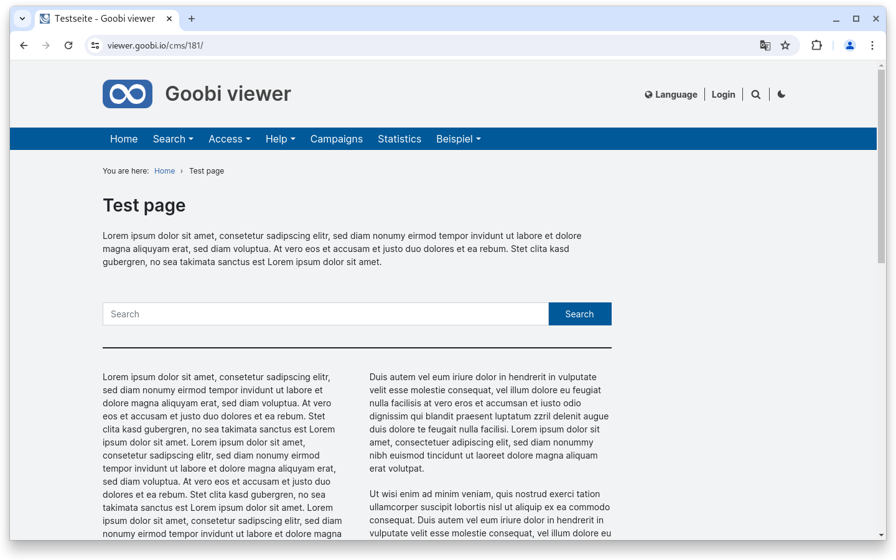

# May

## Coming soon :rocket:&#x20;

* **Revision of EAD** structures
* **technical metadata** from images
* **S3** storage
* **Access restrictions** for **metadata**

## Core

### Backend: Themes

The Goobi viewer backend offers the option of configuring themes. For some time now, the CSS of the Goobi viewer can be overwritten there using the **Quick CSS** functionality. With this release, various minor changes and improvements have been added in this area.

Firstly, **Quick JS** has also been introduced so that JavaScript code can also be set in the theme. This allows, for example, generic core functionality to be configured on a theme-specific basis. Secondly, CodeMirror has been integrated for both Quick CSS and Quick JS. This provides syntax highlighting, which also makes it easier to recognise syntax errors.

Finally, work has also been carried out on the logic of integration into the templates. If there is a main and sub-themes, the Quick CSS and Quick JS from the main theme will now also appear in the sub-themes. This was not the case before and every change that was globally valid had to be stored individually in each subtheme.

<figure><figcaption><p>Quick CSS and Quick JS in the backend with syntax highlighting</p></figcaption></figure>

### Faceting

If a simple "Yes/No" is offered in the faceting, for example "Images available Yes/No" or "Full text available Yes/No", this facet can now be defined by `type="boolean"`. The classic list selection is then no longer displayed, but two buttons with which the selection can be selected or deselected.

<figure><figcaption><p>Yes/No facets can now be displayed as two buttons</p></figcaption></figure>

### ALTO

Tagged ALTO enriched with Named Entities has long been supported in the Goobi viewer. The various entities are highlighted in color. What is new is that we now also support named entities enriched with authority data. If this is available, an underline indicates visually that the word can be clicked on. A popover then opens, from which either the linked authority record can be displayed in the familiar overlay, or alternatively a search for other records with the authority data record can be triggered.

<figure><figcaption><p>Tagged ALTO including authority record link of a tag with new action popover</p></figcaption></figure>

### CMS

There are now three new elements for creating CMS pages: **search bar**, **separator line** and **text (two-column)**.

The search slot can be given an optional heading, but otherwise displays a search slot that can be used to trigger a global search.

The separator line can be used to visually separate sections from one another.

The text (two columns) automatically displays the entered continuous text in two columns.

<figure><figcaption><p>New elements for a CMS page</p></figcaption></figure>

### Slider

The integrated slider preview has been revised and now analyses the frontend styling. It is also possible to change the width of the preview dynamically in order to test the display on different screen sizes directly.

<figure><figcaption><p>Sliders in the backend now have a preview adapted to the frontend styling</p></figcaption></figure>

### Accessibility

Various changes have been made to the core to improve accessibility. The biggest change concerns the sliders, which are now accessible for the first time thanks to an update of the Javascript library used. In addition, translated language variables have been added for better orientation. In addition, the links to buttons in the language switcher have been changed, as semantically speaking, the action "Change the language" is executed here rather than "Reload the page". Although the latter happens, it is only a consequence of the action. Finally, further `aria-label` or `alt` attributes have been added or unnecessary `title` attributes removed. The usability of the Chronology widget has been improved as well as the compatibility of screen readers in the area of search hit groups and highlighting within search results.

### Snippets

* Core: In the feedback form, the reply-to header is now set to the sender of the feedback.
* Core: Minor adjustments have been made to the wording and help texts when defining cards in the backend.
* Core: The fuzzy search is now consistently reset for new search queries. Previously, this sometimes resulted in undesirable behavior.
* Connector: Various small adjustments have been made to the OAI interface to improve the validation of the delivered results.

## Indexer

There is a significant performance improvement in the indexing of EAD files after we received a 70MB EAD file with over 140,000 nodes for testing. This is now processed in under 30 seconds. The same logic is also implemented for other metadata formats but we are not sure if the improvement here is noticeable or more theoretical.

Support for the Kulturnav authority database is also new. The optional configuration file [`normdatamap_json.properties`](https://github.com/intranda/goobi-viewer-core-config/blob/develop/goobi-viewer-core-config/src/main/resources/install/normdatamap\_json.properties) can be used for mapping the fields.

## Code analysis

The following screenshots show the SonarCloud analysis of the current release. More information is available directly on the [project page](https://sonarcloud.io/organizations/intranda/projects).

<figure><figcaption><p>SonarCloud Analysis: Goobi viewer Core - for the Git Tag v24.05</p></figcaption></figure>

<figure><figcaption><p>SonarCloud Analysis: Goobi viewer Indexer - for the Git Tag v24.05</p></figcaption></figure>

<figure><figcaption><p>SonarCloud Analysis: Goobi viewer Connector - for the Git Tag v24.05</p></figcaption></figure>

## Version numbers&#x20;

The versions that must be entered in the `pom.xml` of the theme in order to get the functions described in this digest are:

```markup
<dependency>
    <groupId>io.goobi.viewer</groupId>
    <artifactId>viewer-core</artifactId>
    <version>24.05</version>
</dependency>
<dependency>
    <groupId>io.goobi.viewer</groupId>
    <artifactId>viewer-core-config</artifactId>
    <version>24.05</version>
</dependency>
<dependency>
    <groupId>io.goobi.viewer</groupId>
    <artifactId>viewer-connector</artifactId>
    <version>24.05</version>
</dependency>
```

The **Goobi viewer Indexer** has the version number **24.05**\
The **Goobi viewer Crowdsourcing Module** has the version number **24.05**
