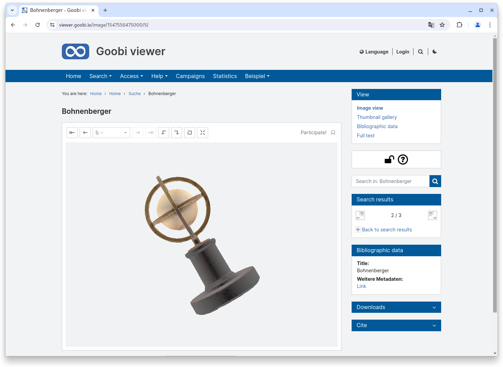

# June

## Coming soon :rocket:&#x20;

* **technical metadata** from images
* **S3** storage
* **Access restrictions** for **metadata**

## Announcements


In **July** and **August**, the **Goobi viewer team** will only be **available to a limited extent** due to various annual holidays.


## Developments

### Archives

The presentation of archives in the Goobi viewer has been completely redeveloped. We have moved away from BaseX as the database and data source and the EAD files - like all other metadata formats - are now written to the Apache Solr search index. This approach has various advantages. For example, the data flow is now the same for all supported formats: the files are stored in the hotfolder and the Goobi viewer indexer takes care of the preparation. Another advantage is that the standardised data storage location makes it possible to search the entire Goobi viewer database across all formats. Archive holdings can now also be found in the familiar search mask. This was not previously the case, as it was not possible to search within Solr and BaseX at the same time and then merge the results. Another positive side effect is that nodes can now be found for which no digitised version exists. For individual hits, you can now choose to open either the factory view or the archive view:

<figure><figcaption><p>Search results show digitised version of record and result in archive holdings</p></figcaption></figure>

The configuration of the archive metadata has also been harmonised as a result of the changeover. The previous, completely customised method has been removed and the configuration is now carried out using the syntax used everywhere in `config_viewer.xml`.

The changeover has also led to a massive improvement in performance. Even very large archive trees (60MB EAD file with almost 170,000 nodes) can now be loaded, viewed and navigated quickly.

Another feature is the support of access restrictions for individual nodes in the archive. This allows individual branches to be hidden and only made accessible to certain users / groups or other authorised users.

<figure><figcaption><p>Selected unit in the archive tree</p></figcaption></figure>

<figure><figcaption><p>Record view with archive widget for localisation in the collection</p></figcaption></figure>

### Config Editor&#x20;

The options for editing configuration files in the Goobi viewer backend have been expanded. A new addition is the ability to upload and download configuration files directly. In order to accommodate the icons required for this in the existing design, the status indicator (file read-only or file locked) has now been moved to the beginning of the respective line.&#x20;

In addition, file backups can now not only be downloaded, but also transferred directly to the integrated editor with a click. This significantly improves usability!&#x20;

In the background, a change was made to the encoding when saving `config_viewer.xml`. This was always written with **CRLF** (Carriage Return, Line Feed) line breaks, even if the Goobi viewer was installed on a Linux server. This resulted in unsightly `^M` characters at the end of each line when editing the file on the command line. Now the line breaks are set according to the system settings. CRLF is still used on Windows systems, but Linux systems now correctly use **NL** (New Line).

<figure><figcaption><p>Extended functionality in the integrated configuration editor</p></figcaption></figure>

### 3D objects

3D files are no longer downloaded immediately when the corresponding page is opened in the Goobi viewer. Instead, a message appears beforehand indicating how much data needs to be downloaded. If you then click on the Show button, a progress bar appears informing you about the download.

The display of the 3D objects has remained the same, but the usability has been significantly improved by this change, especially for large files.

<figure><figcaption><p>A text informs about the amount of data to be downloaded for the 3D display</p></figcaption></figure>

<figure><figcaption><p>A progress bar provides information on progress</p></figcaption></figure>

<figure><figcaption><p>At the end, the 3D object is presented in the web browser as usual.</p></figcaption></figure>

### Snippets

* Core: In the advanced search, the filters are now automatically listed in the first drop-down field by default.&#x20;
* Core: Badges of citation links were not displayed completely despite correct configuration. The error has been fixed.&#x20;
* Core: If images are integrated via an external IIIF interface, the standard download options are now also available there&#x20;
* Core: The display of the widget for searching in the record can now optionally be linked to the availability of full texts.&#x20;
* Indexer: The indexing of METS/MARC data records has been extended.

## Code analysis

The following screenshots show the SonarCloud analysis of the current release. More information is available directly on the [project page](https://sonarcloud.io/organizations/intranda/projects).

<figure><figcaption><p>SonarCloud Analysis: Goobi viewer Core - for the Git Tag v24.06</p></figcaption></figure>

<figure><figcaption><p>SonarCloud Analysis: Goobi viewer Indexer - for the Git Tag v24.06</p></figcaption></figure>

<figure><figcaption><p>SonarCloud Analysis: Goobi viewer Connector - for the Git Tag v24.06</p></figcaption></figure>

## Version numbers&#x20;

The versions that must be entered in the `pom.xml` of the theme in order to get the functions described in this digest are:

```markup
<dependency>
    <groupId>io.goobi.viewer</groupId>
    <artifactId>viewer-core</artifactId>
    <version>24.06</version>
</dependency>
<dependency>
    <groupId>io.goobi.viewer</groupId>
    <artifactId>viewer-core-config</artifactId>
    <version>24.06</version>
</dependency>
<dependency>
    <groupId>io.goobi.viewer</groupId>
    <artifactId>viewer-connector</artifactId>
    <version>24.06</version>
</dependency>
```

The **Goobi viewer Indexer** has the version number **24.06**\
The **Goobi viewer Crowdsourcing Module** has the version number **24.06**
