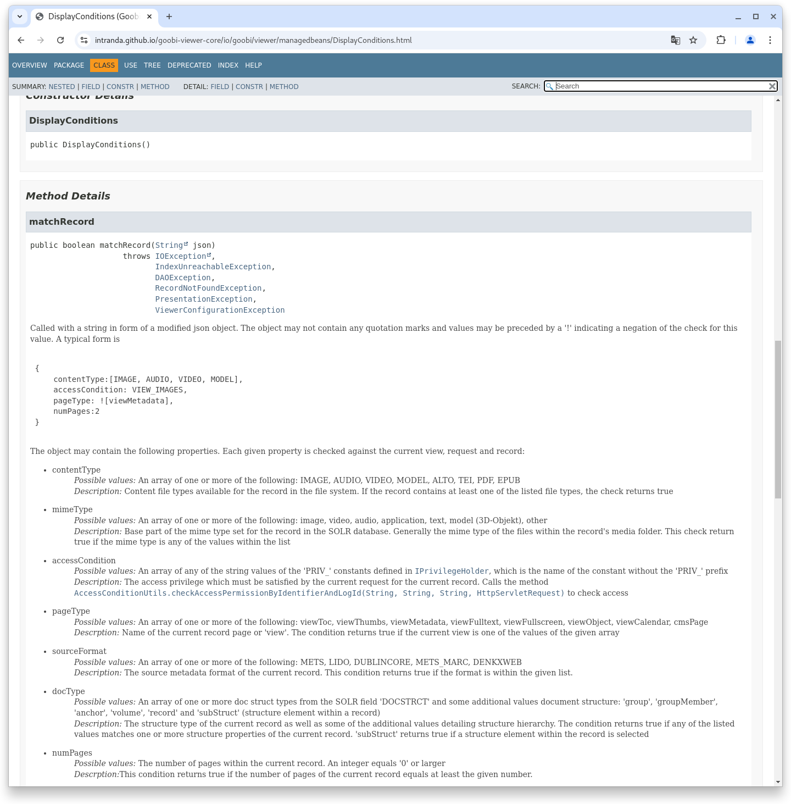
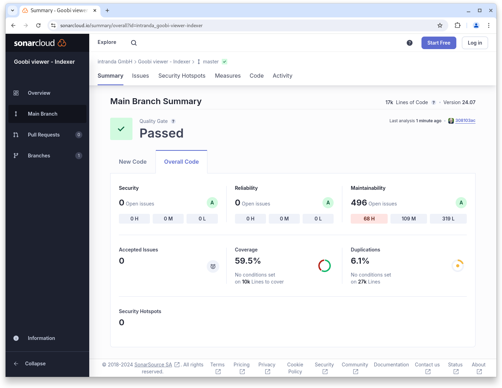
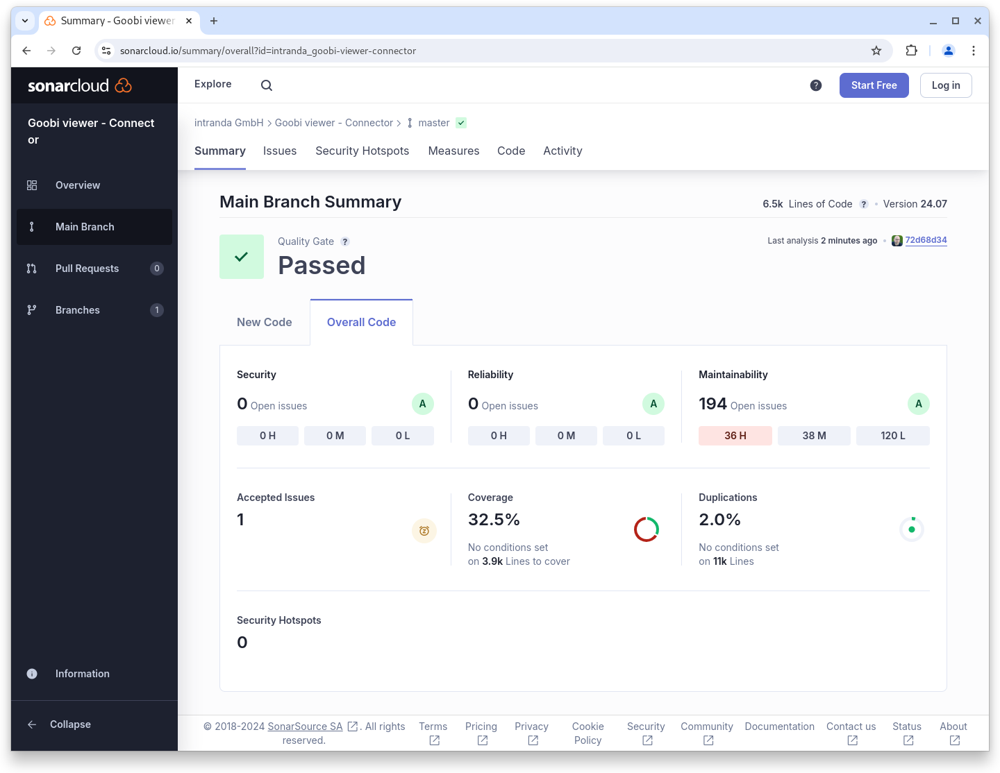

# July

## Coming soon :rocket:&#x20;

* **Year selection** in calendar search as **overview**
* **Technical metadata** from images
* **Access restrictions** for **metadata**

## Announcements


In **July** and **August**, the **Goobi viewer team** will only be **available to a limited extent** due to various annual holidays.


## Developments

### Sidebar widgets

The conditions under which widgets or content from widgets are displayed in the sidebar have grown and adapted over the years. With the July release, we have fundamentally tidied this up and introduced a standardised, new system that can be used to control what is displayed when and how. There will probably be some reworking in the coming months because we let a few things slip through during the migration, but the new DisplayConditions will help us to keep an overview in the future. Further information, especially for developers, can be found in the Javadocs:

<figure><figcaption><p>Example Javadoc for the matchRecord method in the DisplayConditions class</p></figcaption></figure>


Link to Javadoc


### Snippets

* EPub documents can now be displayed inline in the Goobi viewer desktop client
* An annoying bug that downloaded JPEG files as JFIF when downloading under Windows has been fixed by implementing a workaround

## Code analysis

The following screenshots show the SonarCloud analysis of the current release. More information is available directly on the [project page](https://sonarcloud.io/organizations/intranda/projects).

<figure><figcaption><p>SonarCloud Analysis: Goobi viewer Core - for the Git Tag v24.07</p></figcaption></figure>

<figure><figcaption><p>SonarCloud Analysis: Goobi viewer Indexer - for the Git Tag v24.067</p></figcaption></figure>

<figure><figcaption><p>SonarCloud Analysis: Goobi viewer Connector - for the Git Tag v24.07</p></figcaption></figure>

## Version numbers&#x20;

The versions that must be entered in the `pom.xml` of the theme in order to get the functions described in this digest are:

```markup
<dependency>
    <groupId>io.goobi.viewer</groupId>
    <artifactId>viewer-core</artifactId>
    <version>24.07.8</version>
</dependency>
<dependency>
    <groupId>io.goobi.viewer</groupId>
    <artifactId>viewer-core-config</artifactId>
    <version>24.07.2</version>
</dependency>
<dependency>
    <groupId>io.goobi.viewer</groupId>
    <artifactId>viewer-connector</artifactId>
    <version>24.07</version>
</dependency>
```

The **Goobi viewer Indexer** has the version number **24.07.1**\
The **Goobi viewer Crowdsourcing Module** has the version number **24.07.1**
