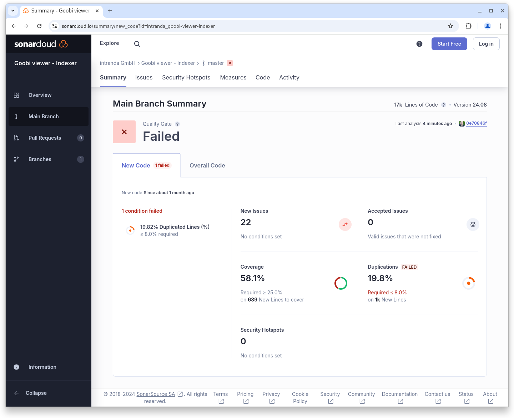

# August

## Coming soon :rocket:&#x20;

* **Multiple masks** within the **advanced search**
* **Access restrictions** for **metadata**

## Announcements


In **July** and **August**, the **Goobi viewer team** will only be **available to a limited extent** due to various annual holidays.


## Developments

### Calendar

Previously, the year selection in the calendar search was displayed as a drop-down menu:

<figure><figcaption><p>Calendar search with drop-down menu</p></figcaption></figure>

<figure><figcaption><p>Calendar search with expanded drop-down menu</p></figcaption></figure>

This view has now been replaced by a listing by century and individual badges for the years. A clear visual demarcation now allows you to access the desired year more quickly and with fewer clicks.

<figure><figcaption><p>Calendar search with new access by centuries</p></figcaption></figure>

### Archives

&#x20;As part of the archive developments, there were various minor reworking and feature developments to finalise the solution.

A minor but very essential change for the configuration is that changes in the configuration file are applied directly in the display and no new session or restart of the application is necessary.

For administrators, the top bar has been integrated into the archive view and the ‘Actions’ widget already familiar from the record view has also been introduced. In the widget, a file can be re-indexed, downloaded or deleted.

<figure><figcaption><p>Archive view with top bar and admin widget</p></figcaption></figure>

If digital copies are available for a directory unit, this is indicated by a pictogram in the tree. If these digital copies are now subject to an access restriction, this is also visualised.

### Technical metadata from images

The Goobi viewer Indexer has been extended to index technical metadata from images that are available as MIX in the METS/MODS file. The configuration is analogue to the descriptive metadata:

```xml
<MD_TECH_FORMAT_NAME>
    <list>
        <item>
            <xpath>mets:xmlData/mix:mix/mix:BasicDigitalObjectInformation/mix:FormatDesignation/mix:formatName</xpath>
            <addToDefault>false</addToDefault>
        </item>
    </list>
</MD_TECH_FORMAT_NAME>
```

The Goobi viewer core can then display the metadata in its own widget in the sidebar. The desired data is configured in the `<metadataList type="page" />` for this purpose:

```xml
<metadataList type="page">
    <template name="_DEFAULT">
        <metadata label="MD_TECH_FORMAT_NAME">
            <param key="MD_TECH_FORMAT_NAME" type="field" />
        </metadata>
        <metadata label="MD_TECH_BASIC_IMAGE_INFO" value="{1}{3}" group="true">
            <param key="MD_VALUE" type="field" />
            <param key="MD_TECH_IMAGE_COLOR_SPACE" type="field" prefix=",_SPACE_" />
        </metadata>
        <metadata label="MD_TECH_BYTE_ORDER">
            <param key="MD_TECH_BYTE_ORDER" type="field" />
        </metadata>
        <metadata label="MD_TECH_IMAGE_DATETIME_CREATED">
            <param key="MD_TECH_IMAGE_DATETIME_CREATED" type="datefield" pattern="yyyy-MM-dd'T'HH:mm:ss" />
        </metadata>
    </template>
</metadataList>
```

<figure><figcaption><p>Display of technical metadata for the image in the sidebar</p></figcaption></figure>

### Snippets

* **IIIF**: The Change Discovery API can now optionally receive a startDate and a filter as Solr query as GET parameters
* **Sidebar**: The RIS download badge is now configurable
* **CMS**: The display of options above the search hit list can now be switched on and off
* **CMS**: Internally, the source code for the various collection displays (tiles, tree, list) has been revised and standardised
* **Search results**: The search results are now displayed more homogeneously if there is a mixture of results with and without images. It is now also possible to configure grouped metadata for the search result list.

## Code analysis

The following screenshots show the SonarCloud analysis of the current release. More information is available directly on the [project page](https://sonarcloud.io/organizations/intranda/projects).

<figure><figcaption><p>SonarCloud Analysis: Goobi viewer Core - for the Git Tag v24.08</p></figcaption></figure>

<figure><figcaption><p>SonarCloud Analysis: Goobi viewer Indexer - for the Git Tag v24.08</p></figcaption></figure>

<figure><figcaption><p>SonarCloud Analysis: Goobi viewer Connector - for the Git Tag v24.07</p></figcaption></figure>

**Note**: In the Goobi viewer Indexer, the quality gate has not been reached due to the development of new functionality, as there is too much code duplication. However, this only applies to new source code. The quality gate for the entire code has been reached.

## Version numbers&#x20;

The versions that must be entered in the `pom.xml` of the theme in order to get the functions described in this digest are:

```markup
<dependency>
    <groupId>io.goobi.viewer</groupId>
    <artifactId>viewer-core</artifactId>
    <version>24.08.4</version>
</dependency>
<dependency>
    <groupId>io.goobi.viewer</groupId>
    <artifactId>viewer-core-config</artifactId>
    <version>24.08</version>
</dependency>
<dependency>
    <groupId>io.goobi.viewer</groupId>
    <artifactId>viewer-connector</artifactId>
    <version>24.08</version>
</dependency>
```

The **Goobi viewer Indexer** has the version number **24.08**\
The **Goobi viewer Crowdsourcing Module** has the version number **24.08**
