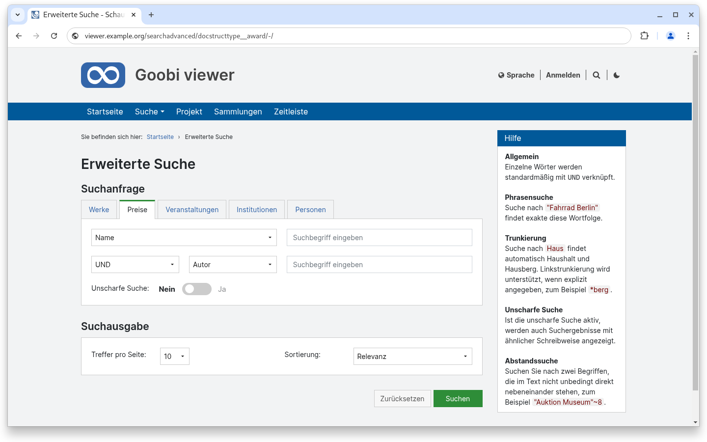
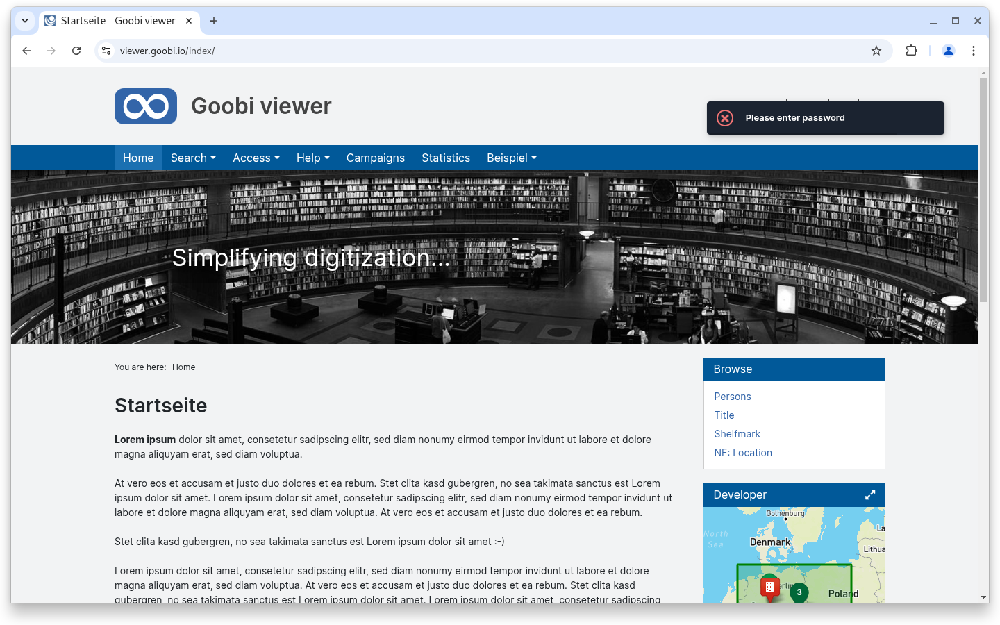
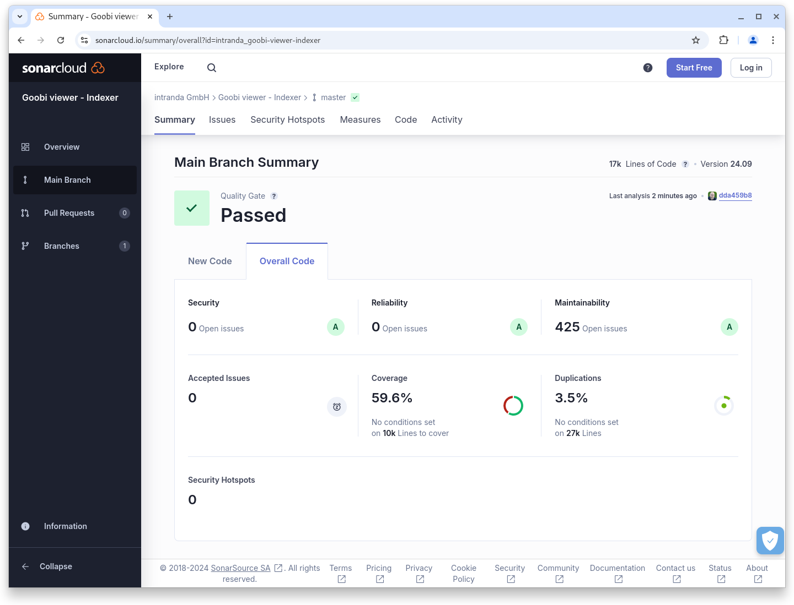

# September

## Coming soon :rocket:&#x20;

* **Access-restricted metadata**
* **Metadata**: **Configuration** and **display**

## Announcements


With this version, the Solr internal management of Iddocs will be changed to an alternative data type. This is in preparation for a **breaking change** in the Goobi viewer Indexer planned for **January 2025**.


## Developments

### Advanced search

The Goobi viewer core has long offered the option of configuring various search mask templates for the advanced search. However, the implementation of this functionality was previously only possible with special development within individual themes. With this release, the visual implementation has also been integrated into the Goobi viewer core so that the functionality can be used across the board. The various search templates are displayed as individual tabs.

Using the styling in the theme, it is also possible to assign individual colours to the individual tabs. This colour is then reflected as a coloured bar above the tab and in the search button.

<figure><figcaption><p>Various templates in the advanced search plus individual colours</p></figcaption></figure>

Together with the option of defining CSS classes for search results and record pages, this makes it possible to implement uniform colours from the search mask and search hits to the record display.

<figure><figcaption><p>Individual colours for different search results</p></figcaption></figure>

### Notifications

The notifications of the Goobi viewer are now also displayed in the dark colour style familiar from the backend. This significantly increases visibility, especially in light-coloured themes and on light backgrounds. The colour scheme is thus consistently continued. All actions that come from the backend, the administration or from the application itself are now displayed in a dark colour and can therefore be directly recognised and assigned as such.

<figure><figcaption><p>The notifications of the Goobi viewer are now dark</p></figcaption></figure>

### Snippets

* **Backend**: The top bar, which is permanently visible to administrators at the top of the screen, now also displays information about background tasks.
* **Archive**: It is now possible to expand and collapse the tree by clicking on it.
* **Performance**: Within the archive view and also within the facets, the speed of some operations has been significantly improved.
* **Download**: The PDF download is now only offered for locally available images, no longer for externally integrated images.

## Code analysis

The following screenshots show the SonarCloud analysis of the current release. More information is available directly on the [project page](https://sonarcloud.io/organizations/intranda/projects).

<figure><figcaption><p>SonarCloud Analysis: Goobi viewer Core - for the Git Tag v24.09</p></figcaption></figure>

<figure><figcaption><p>SonarCloud Analysis: Goobi viewer Indexer - for the Git Tag v24.09</p></figcaption></figure>

<figure><figcaption><p>SonarCloud Analysis: Goobi viewer Connector - for the Git Tag v24.09</p></figcaption></figure>

## Version numbers&#x20;

The versions that must be entered in the `pom.xml` of the theme in order to get the functions described in this digest are:

```markup
<dependency>
    <groupId>io.goobi.viewer</groupId>
    <artifactId>viewer-core</artifactId>
    <version>24.09.8</version>
</dependency>
<dependency>
    <groupId>io.goobi.viewer</groupId>
    <artifactId>viewer-core-config</artifactId>
    <version>24.09.2</version>
</dependency>
<dependency>
    <groupId>io.goobi.viewer</groupId>
    <artifactId>viewer-connector</artifactId>
    <version>24.09.1</version>
</dependency>
```

The **Goobi viewer Indexer** has the version number **24.09**\
The **Goobi viewer Crowdsourcing Module** has the version number **24.09**
