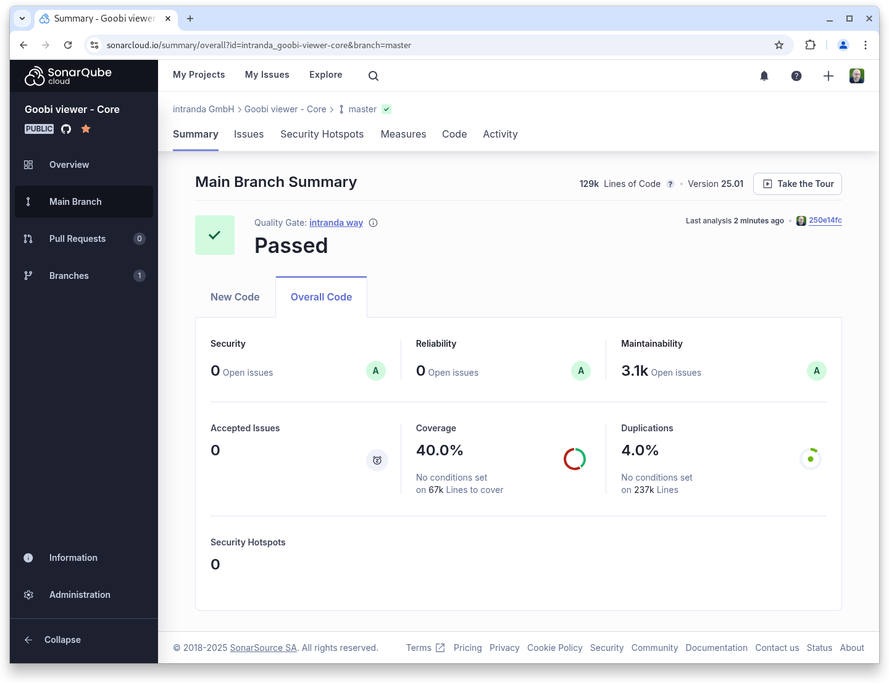
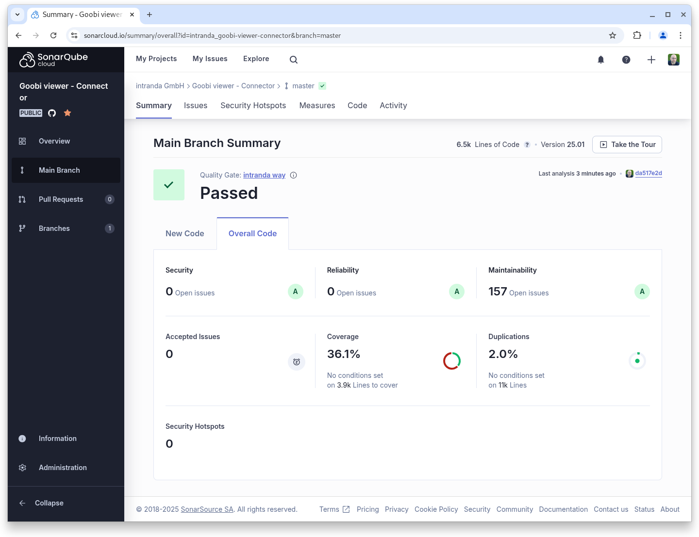

# January

## Coming soon :rocket:&#x20;

* Centralised **announcements** of **maintenance** work
* Support for the **METS/MODS** from the **DDB newspaper portal**

## Developments

### Technical

The January release of the Goobi viewer contains no new features, but a large number of updates and changes under the bonnet.


Despite all the technical changes, the data remains unchanged.


Among the changes, the following topics are particularly noteworthy:

#### Java 21

The Goobi viewer and its associated components now require Java 21. This means that both the Java Runtime Environment (the part that must be installed on the server) and the Java Development Kit (the part that developers work with and with which the applications are compiled) must be Java 21. The change was necessary in order to remain compatible with the Java libraries used and thus enable future security updates.

#### Tomcat 10

A few years ago, a jolt went through the Java scene and `Javax` became `Jakarta`. This change in the substructure was so far-reaching that it took a few years for it to reach the wider Java world / Java libraries. However, this change is not backwards compatible and the more external libraries are used, the more libraries had to make this change of their own accord.

In the end, the Linux distributions decided in our favour that we should now also make this change in the Goobi viewer. The currently stable Debian version, as well as the currently stable Ubuntu Linux Server LTS version, no longer provides packages for Tomcat 9. This means that we would have had to install and maintain these packages manually. Packages for Tomcat 10.1 are delivered with support for Jakarta EE 10, making the switch from `Javax` to `Jakarta` mandatory.

#### Solr 9.8.0

We thought that if many technical components are not downward compatible in January, we should also update the Solr server. A schema update was necessary here, including a reindexing of the database, as obsolete field types were changed. The configuration of deprecated elements was also adapted to the current syntax.

#### Goobi viewer Indexer

If several XPATH expressions had to be specified for a field in the configuration, this was previously unnecessarily complex with a nested list. We have removed this nesting with the January release. This makes the configuration clearer and easier to read and customise. An XSL file and corresponding calls for the automatic migration of the configuration are available in the update instructions.

### Snippets

* **Core**: The XSLT, which is used when delivering METS files, has been extended to filter out the METS fileGrp PRESENTATION.
* **Indexer**: A bug that caused EAD files with timestamps to be indexed multiple times has been fixed.
* **Calendar**: After selecting a year in the calendar search, this year is now also displayed above the calendar.

## Code analysis

The following screenshots show the SonarCloud analysis of the current release. More information is available directly on the [project page](https://sonarcloud.io/organizations/intranda/projects).

<figure><figcaption><p>SonarCloud Analysis: Goobi viewer Core - for the Git Tag v25.01</p></figcaption></figure>

<figure><figcaption><p>SonarCloud Analysis: Goobi viewer Indexer - for the Git Tag v25.01</p></figcaption></figure>

<figure><figcaption><p>SonarCloud Analysis: Goobi viewer Connector - for the Git Tag v25.01</p></figcaption></figure>

## Version numbers&#x20;

The versions that must be entered in the `pom.xml` of the theme in order to get the functions described in this digest are:

```markup
<dependency>
    <groupId>io.goobi.viewer</groupId>
    <artifactId>viewer-core</artifactId>
    <version>25.01</version>
</dependency>
<dependency>
    <groupId>io.goobi.viewer</groupId>
    <artifactId>viewer-core-config</artifactId>
    <version>25.01</version>
</dependency>
<dependency>
    <groupId>io.goobi.viewer</groupId>
    <artifactId>viewer-connector</artifactId>
    <version>25.01</version>
</dependency>
```

The **Goobi viewer Indexer** has the version number **25.01**\
The **Goobi viewer Crowdsourcing Module** has the version number **25.01**
