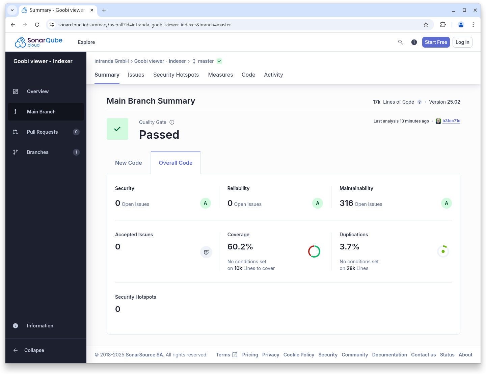
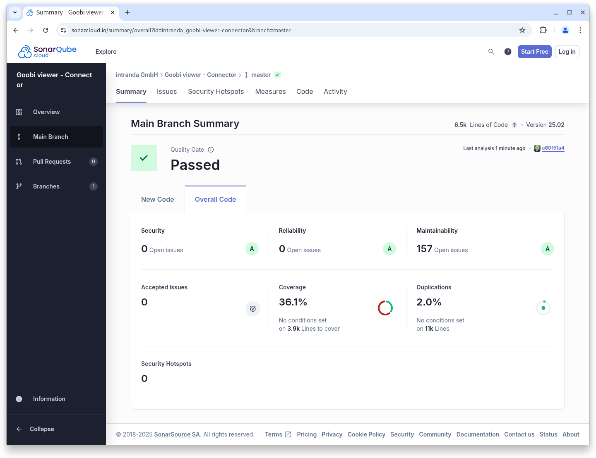

# February

## Coming soon :rocket:&#x20;

* Centralised **announcements** of **maintenance** work
* Support for the **METS/MODS** from the **DDB newspaper portal**

## Developments

### General

There is not much visible to report from February. We mainly focussed on the completion of existing projects and smaller developments and adjustments that were brought to us by users. There was also some minor rework on the Java 21 and Tomcat 10 changeover.

Internally, the revision of Born-Digital support should be emphasised. There will be a more detailed use case describing this in the documentation. We will refer to this in the corresponding digest.

### Snippets

* **Docker**: Completion of the Java 21, Tomcat 10 and Solr 9.8.0 conversion
* **Documentation**: Incorporation of previously undocumented switches and parameters
* **Archive**: A separate functionality is now defined for access restrictions within archives and is no longer used for displaying metadata.
* **Metadata**: Replace rules are now also applied to grouped metadata.
* **Bugfix**: After the introduction of access restrictions for metadata in December last year, grouped metadata was no longer displayed if it was subject to an expired moving wall configuration.
* **CMS**: Non-public CMS pages now also completely hide the sidebar.
* **Performance**: When preparing a table of contents, the Solr query has been improved so that fewer requests are made, thereby improving performance.
* **Search**: In the phrase search, no sub-hits were displayed under certain constellations

## Code analysis

The following screenshots show the SonarCloud analysis of the current release. More information is available directly on the [project page](https://sonarcloud.io/organizations/intranda/projects).

<figure><figcaption><p>SonarCloud Analysis: Goobi viewer Core - for the Git Tag v25.02</p></figcaption></figure>

<figure><figcaption><p>SonarCloud Analysis: Goobi viewer Indexer - for the Git Tag v25.02</p></figcaption></figure>

<figure><figcaption><p>SonarCloud Analysis: Goobi viewer Connector - for the Git Tag v25.02</p></figcaption></figure>

## Version numbers&#x20;

The versions that must be entered in the `pom.xml` of the theme in order to get the functions described in this digest are:

```markup
<dependency>
    <groupId>io.goobi.viewer</groupId>
    <artifactId>viewer-core</artifactId>
    <version>25.02</version>
</dependency>
<dependency>
    <groupId>io.goobi.viewer</groupId>
    <artifactId>viewer-core-config</artifactId>
    <version>25.02</version>
</dependency>
<dependency>
    <groupId>io.goobi.viewer</groupId>
    <artifactId>viewer-connector</artifactId>
    <version>25.02</version>
</dependency>
```

The **Goobi viewer Indexer** has the version number **25.02**\
The **Goobi viewer Crowdsourcing Module** has the version number **25.02**
